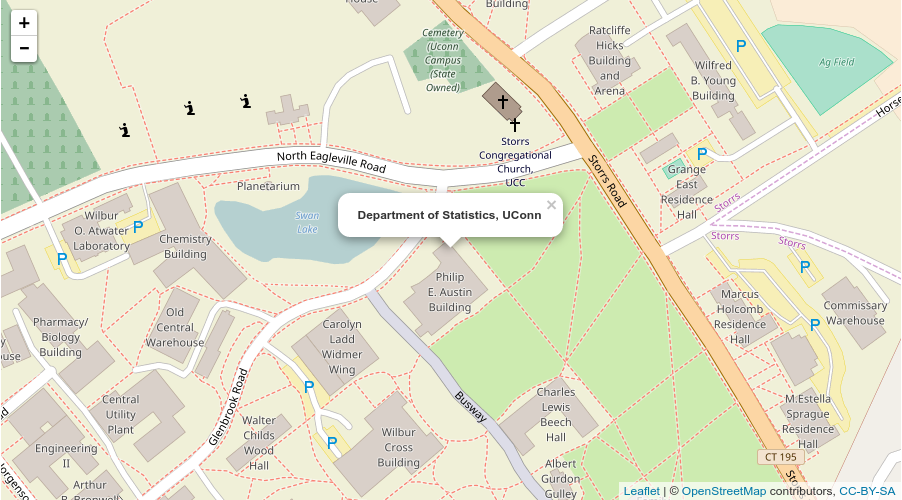
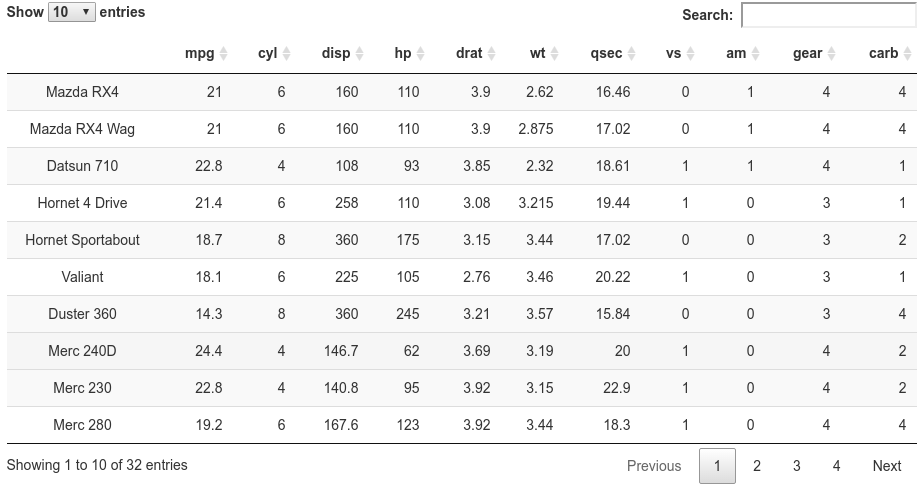
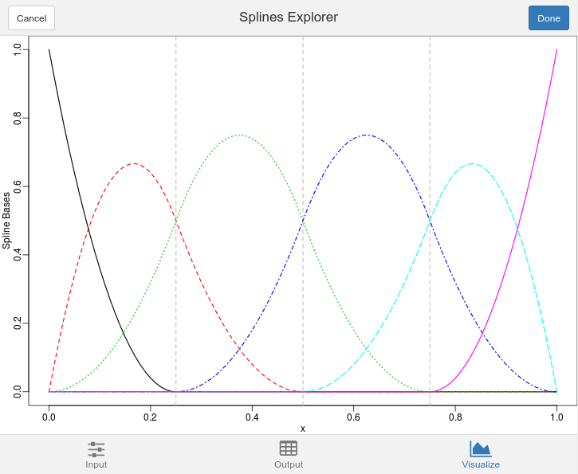

```{r setup, echo = FALSE, message = FALSE, warning = FALSE}
## some utility functions, see the source code for details
source("utils_template.R")

## specify the packages needed
pkgs <- c("splines2", "DT", "webshot", "leaflet")
need.packages(pkgs)

## external data can be read in by regular functions,
## such as read.table or load

## get output format in case something needs extra effort
outFormat <- knitr::opts_knit$get("rmarkdown.pandoc.to")
## "latex" or "html"

## for latex and html output
isHtml <- identical(outFormat, "html")
isLatex <- identical(outFormat, "latex")
latex <- ifelse(isLatex, '\\LaTeX\\', 'LaTeX')

## specify global chunk options
knitr::opts_chunk$set(fig.width = 5, fig.height = 4, dpi = 300,
                      out.width = "90%", fig.align = "center")

```


# Introduction {#sec:intro}

This document is designed as a template for data science lab projects.  However,
it can also be used as a general template in `r proglang("R Markdown")` for a
single document.


The benefits of setting up a template in `r proglang("R Markdown")` are
its simple syntax and flexible output format with the help
of [`r pkg("pandoc")`][pandoc]. In addition, it is in favor of reproducible
studies, which have been receiving increasing attention in modern research.


Cross-reference of mathematical equations, tables, and figures used to be a
challenge when using `r proglang("R markdown")`. Usually extra packages, such as
`r pkg("kfigr")` [@koohafkan2015kfigr], and extra efforts were needed for
automatic and satisfactory cross-referencing.  Fortunately, the arrival of the
package `r pkg("bookdown")` [@xie2017bookdown] provides a much easier and more
consistent syntax for cross-referencing.


Instead of providing a minimal but non-informative template framework, we review
most of the basic syntax of writing a single `r proglang("R Markdown")` document
With the power of the `r pkg("bookdown")` with examples.  However, this is not
intended as a tutorial of `r proglang("R Markdown")` or the `r pkg("bookdown")`.
Readers are encouraged to skim the PDF or HTML output, and have a closer look at
the source document of this template directly.


The rest of this project template is organized as follows: In Section
\@ref(sec:math) and Section \@ref(sec:theorem), we present examples of writing
mathematical equations, and mathematical environments, such as theorem, lemma,
and definition, etc., respectively.  Some examples for reproducing figures and
including existing figures are given in Section \@ref(sec:figure).  The
generation of tables and other `r proglang("R")` objects is discussed in Section
\@ref(sec:table). A brief demonstration of a code chunk is given in Section
\@ref(sec:code). Several example HTML widgets and Shiny applications are given
in Section \@ref(sec:widgets) and Section \@ref(sec:shiny), respectively.  At
last but not least, in Section \@ref(sec:summary), we point readers to some
external resources for further reading and more advanced usage of
`r pkg("bookdown")`.


# Math Equations {#sec:math}

Inline math expressions are quoted by `$` in the source document, which is
consistent with the syntax of `r latex`. For instance, $x_i^2$, $\sin(x)$, and
$\theta$ are inline expressions. The equations can be simply quoted by `$$` if
no cross-reference is needed, where regular `r latex` commands under the math
environment can be used.  For equations that need cross-referencing,
`r latex` environments for mathematical equations, such as `equation` or `align`,
can be used directly. For example, Equation \@ref(eq:euler) is the well-known
Euler's identity.
\begin{align}
    e^{i\theta} = \cos(\theta) + i \sin(\theta).
    (\#eq:euler)
\end{align}


# Math Theorem Environments  {#sec:theorem}

A mathematical theorem can be put inside a `theorem` chunk followed by its
label. For example, the Central Limit Theorem (CLT) is presented in Theorem
\@ref(thm:clt).


```{theorem, clt}
**(Central Limit Theorem)** Let $X_1,\ldots,X_n$ be independent, identically
distributed (i.i.d.) random variables with finite expectation $\mu$, and
positive, finite variance $\sigma^2$, and set $S_n=X_1 + X_2 + \cdots + X_n$, $n
\ge 1$. Then
$$
    \frac{\bar{S}_n - n\mu}{\sigma \sqrt{n}}\xrightarrow{L} N(0, 1)
    ~\mathrm{as}~n\rightarrow\infty.
$$
```

Similarly, a lemma can be put inside a `lemma` chunk.  For instance, the First
Borel-Cantelli Lemma is given in Lemma \@ref(lem:bc).

```{lemma, bc}
**(First Borel-Cantelli Lemma)** Let $\{A_n\}_{n \ge 1}$ be a sequence of events
with
$$
    \sum_n P(A_n) < \infty.
$$
Then
$$
P(A_n~\mathrm{i.o.}) = P(\limsup\limits_{n\rightarrow\infty}) = 0.
$$
```

All the available theorem environments and their label prefix designed for
cross-referencing are summarized in Table \@ref(tab:theorem-envs).


(ref:theorem-envs) Theorem environments in `r pkg("bookdown")`.

<!-- source extracted from bookdown package  -->

```{r theorem-envs, echo = FALSE}
knitr::kable(data.frame(
  Environment = names(bookdown:::theorem_abbr),
  `Printed Name` = unname(unlist(bookdown:::label_names_math)),
  `Label Prefix` = unname(bookdown:::theorem_abbr),
  stringsAsFactors = FALSE, check.names = FALSE
), caption = '(ref:theorem-envs)', booktabs = TRUE)
```


# Figures {#sec:figure}

Figures can be generated by a code chunk within the source document.  For
example, integrals and derivatives of cubic B-splines with three internal
knots generated by the `r pkg("splines2")` package [@wang2017splines2] are
plotted by the following `r proglang("R")` code chunk. The resulting plot is
shown in Figure \@ref(fig:bSplines).


<!-- caption of figure may be defined as follows: -->

(ref:cap-bSplines) Integrals (left) and derivatives (right) of cubic B-splines
with three internal knots.

```{r bSplines, echo = TRUE, fig.cap = "(ref:cap-bSplines)", fig.width = 8}
x <- seq.int(0, 1, 0.01)
knots <- c(0.3, 0.5, 0.6)
ibsMat <- ibs(x, knots = knots, intercept = TRUE)
dbsMat <- dbs(x, knots = knots, intercept = TRUE)
par(mar = c(2.5, 2.5, 0.2, 0.2), mgp = c(1.5, 0.5, 0), mfrow = c(1, 2))
matplot(x, ibsMat, type = "l", ylab = "B-spline Integrals")
abline(v = knots, lty = 2, col = "gray")
matplot(x, dbsMat, type = "l", ylab = "B-spline Derivatives")
abline(v = knots, lty = 2, col = "gray")
```

It is possible that we may not wish to regenerate a plot from `r proglang("R")`
code.  Instead of reproducing plots on the fly, we may also include an existing
figure in the document by the function `knitr::include_graghics`. Suppose we
have already generated quadratic M-splines and I-splines [@ramsay1988msplines]
with three internal knots by `r pkg("splines2")` and saved the plots under
directory `figs`, respectively. Then we may skip the regeneration step and
include the existing plot directly as follows:


(ref:cap-miSplines) Quadratic M-spline (left) and I-spline (right) Bases with
three internal knots.

```{r miSplines, echo = 16, fig.cap = "(ref:cap-miSplines)", out.width = '45%', fig.show = 'hold'}
## we generate the figure as below but not plot it out
if (! dir.exists("figs")) dir.create("figs")
png("figs/mSpline.png", width = 4, height = 3.5, units = "in", res = 300)
msMat <- mSpline(x, knots = knots, degree = 2, intercept = TRUE)
par(mar = c(2.5, 2.5, 0.2, 0.2), mgp = c(1.5, 0.5, 0))
matplot(x, msMat, type = "l", ylab = "M-splines")
abline(v = knots, lty = 2, col = "gray")
foo <- dev.off()
png("figs/iSpline.png", width = 4, height = 3.5, units = "in", res = 300)
isMat <- iSpline(x, knots = knots, degree = 2, intercept = TRUE)
par(mar = c(2.5, 2.5, 0.2, 0.2), mgp = c(1.5, 0.5, 0))
matplot(x, isMat, type = "l", ylab = "I-splines")
abline(v = knots, lty = 2, col = "gray")
foo <- dev.off()
## include the figure generated
knitr::include_graphics(c("figs/mSpline.png", "figs/iSpline.png"))
```

In the code chunk shown above, the chunk option `out.width = '45%'` and
`fig.show = 'hold'` were set so that the plots were placed side by side.  We may
set the chunk option `echo = FALSE` so that the code chunk generating the plots
are excluded from the output. Also, the chunk option `cache` can be set to be
`TRUE` for time-consuming code chunks once the code chunk is unlikely to be
modified.


# Tables and Other R objects {#sec:table}

Tables can be similarly generated by a code chunk within the source document.
Table \@ref(tab:theorem-envs) was, in fact, generated by function
`knitr::kable`.  Another simple example of table generation by `knitr::kable` is
given in the following code chunk. Table \@ref(tab:iris) is the resulting table.

(ref:iris) First six rows of the iris data in the package `r pkg("datasets")`.

```{r iris}
knitr::kable(head(iris), booktabs = TRUE,
             caption = '(ref:iris)')
```

There are other `r proglang("R")` packages that can be of tremendous help in
generating the `r proglang("Markdown")` source for various `r proglang("R")`
objects.  For example, the package `r pkg("xtable")` [@dahl2016xtable] provides
a more sophisticated support for generation of table source for `r latex` and
HTML; the package `r pkg("pander")` [@daroczi2015pander] provides functions for
printing a variety of `r proglang("R")` objects in `r pkg("pandoc")`'s
`r proglang("Markdown")`; the package `r pkg("stargazer")`
[@hlavac2015stargazer] produces `r latex` code, HTML code and SCII text for
well-formatted tables for results from regression models. See
[CRAN task view][taskView] on reproducible research for a more
comprehensive package list.


# Code Chunk {#sec:code}

In addition to `r proglang("R")`, the code chunk can be written in a variety of
other languages, such as `r proglang("Bash")`, `r proglang("Python")`,
`r proglang("SAS")`, etc., by specifying the chunk option `engine`.
The following code chunk is one toy example written in `r proglang("Python 3")`.

<!-- note that we actually set eval to be FALSE here so that readers are able to
reproduce this template without Python 3. -->

```{r pythonCode, eval = FALSE, engine = "python", comment = ">>> "}
foo = "Hello " + "world!"
print("The length of '%s' is %d." % (foo, len(foo)))
```

<!-- The expected result is given as follows -->

```python
>>>  The length of 'Hello world!' is 12.
```

We may set the chunk option `eval = FALSE` if we only want to present the code
without evaluation.


# HTML Widgets {#sec:widgets}

The `r pkg("htmlwidgets")` package [@vaidyanathan2016htmlwidgets] provides
a framework for easily creating `r proglang("R")` bindings to
`r proglang("JavaScript")` libraries.  Several `r proglang("R")` packages
built based on it, such as `r pkg("leaflet")` [@cheng2016leaflet] and
`r pkg("DT")` [@xie2016dt], enable us to embed interactive HTML widgets in
the HTML output. For PDF output, a screenshot taken by the package
`r pkg("webshot")` [@chang2016webshot] will be included instead.


For example, we embed a map for the location of Department of
Statistics at University of Connecticut (UConn) by `r pkg("leaflet")`
in Figure `r ifelse(isLatex, '\\@ref(fig:mapPdf)', '\\@ref(fig:map)')`.


(ref:cap-map) A map widget rendered via the `r pkg("leaflet")` package.

```{r map, eval = isHtml, screenshot.opts = list(delay = 10, zoom = 1), fig.cap = "(ref:cap-map)"}
leaflet(width = 900, height = 500) %>% addTiles() %>%
    setView(- 72.251113, 41.810757, zoom = 17) %>%
    addPopups(- 72.251113, 41.810757,
              '<b>Department of Statistics, UConn</b>')
```

<!-- For pdf output, PhantomJS and the R package webshot is needed. So we
include the screenshot for pdf output instead in case readers do not have
PhantomJS installed. -->

```{r mapPdf, echo = FALSE, eval = isLatex, fig.cap = "(ref:cap-map)"}

```

Another example of using the package `r pkg("DT")` to display `mtcars` data is
given here.  The result is shown in Figure
`r ifelse(isLatex, '\\@ref(fig:dtPdf)', '\\@ref(fig:dt)')`.

(ref:cap-dt) A table widget rendered via the `r pkg("DT")` package.

```{r dt, eval = isHtml, screenshot.opts = list(delay = 10, zoom = 1), fig.cap = "(ref:cap-dt)"}
DT::datatable(mtcars)
```

<!-- For pdf output, PhantomJS and the R package webshot is needed. So we
also include the screenshot for pdf output here. -->

```{r dtPdf, echo = FALSE, eval = isLatex, fig.cap = "(ref:cap-dt)"}

```


# Shiny Apps {#sec:shiny}

The package `r pkg("shiny")` [@chang2017shiny] is a great tool providing readers
with an interactive way to explore data and results.  We may easily build Shiny
applications on our own, deploy, and share it online at [shinyapps.io][shiny.io]
by the package `r pkg("rsconnect")` [@allaire2016rsconnect]. In addition to
building regular applications by `r pkg("Shiny")`, the package `r pkg("miniUI")`
[@cheng2016miniUI] provides layout function designed for Shiny applications with
appropriate size on small screens.


We may embed Shiny applications in the document by `knitr::include_app`, which
is mainly designed for HTML output.  Similarly, a screenshot taken by
`r pkg("webshot")` will be embedded instead for PDF output.  The package
`r pkg("webshot")` provides argument `zoom` for a possible high resolution
screenshot.  However, if the resolution is still not satisfactory, we may take
a screenshot and include it manually by `knitr::include_graphics`.


An example Shiny application visualizing different kind of spline bases is given
in Figure `r ifelse(isLatex, '\\@ref(fig:miniappPdf)', '\\@ref(fig:miniapp)')`.


<!-- for pdf output, knitr::include_app() needs PhantomJS and the R package
webshot. -->

(ref:cap-miniapp) An example of Shiny app visualizing different spline bases
available at <https://wenjie-stat.shinyapps.io/minisplines2>.


```{r miniapp, eval = isHtml, fig.cap = "(ref:cap-miniapp)", screenshot.opts = list(delay = 20, zoom = 2)}
knitr::include_app("https://wenjie-stat.shinyapps.io/minisplines2/", "500px")
```

<!-- 'zoom = 2' somehow produced small plot on upper left corner; 'zoom = 1'
gave screenshot of poor resolution.  So manually include screenshot for pdf
output instead. Please consider contribute to it if you have a better
solution. -->

```{r miniappPdf, echo = FALSE, eval = isLatex, fig.cap = "(ref:cap-miniapp)"}

```


# Summary and Discussion {#sec:summary}

In summary, we provided this project template and reviewed most common
components and their syntax of writing a single `r proglang("R Markdown")`
document with the power and love of `r pkg("bookdown")` and many other fantastic
packages.


@xie2017bookdown provided a thorough introduction to `r pkg("bookdown")`
including more advanced customization and other output formats.
Additionally, the [manual][pandocManual] of `r pkg("Pandoc")` gives all the
available options that can be specified through the `r proglang("YAML")`
metadata section.


The template source and other associated files, such as BibTeX and CSS file, are
available at our GitHub repository
*dslab-templates*: <https://github.com/statds/dslab-templates>.


# Acknowledgment {-}

We would like to thank Yihui Xie and all the other authors and contributors for
the fabulous `r pkg("knitr")`, `r pkg("rmarkdown")`, and `r pkg("bookdown")`
packages. It would also be impossible for this template to work without the
fantastic open-source software: `r proglang("R")`, `r pkg("pandoc")`, etc.


# Reference {-}


[pandoc]: http://pandoc.org/
[pandocManual]: http://pandoc.org/MANUAL.html
[repo]: https://github.com/wenjie2wang/datalab-templates
[taskView]: https://cran.r-project.org/web/views/ReproducibleResearch.html
[shiny.io]: https://www.shinyapps.io/
[wenjie-stat.shinyapps]: https://wwenjie-stat.shinyapps.io/minisplines2
